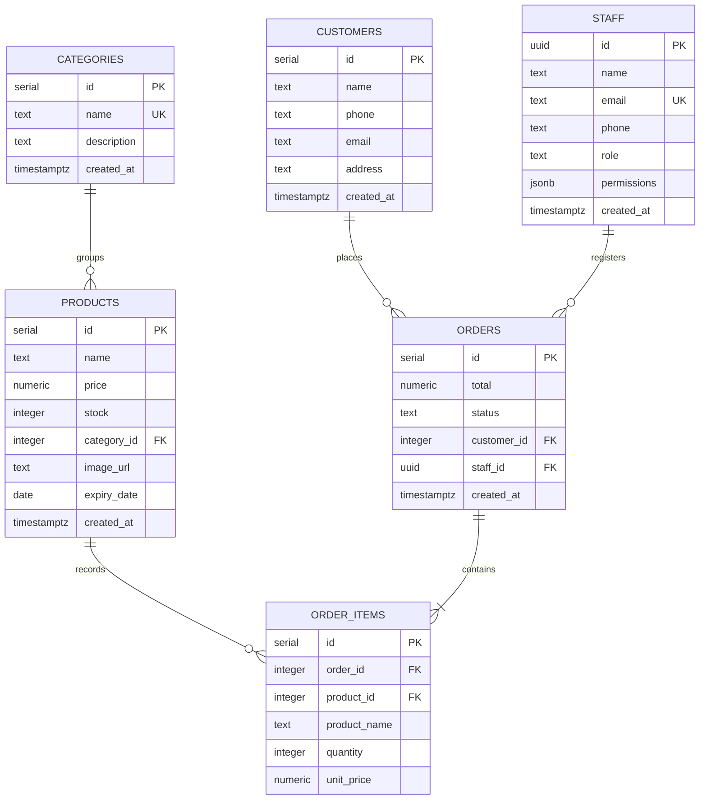

# QuickPOS Pro — Application Analysis & Architecture Guide

Welcome to the full system analysis of **QuickPOS Pro**, a modern, responsive, and permission-aware Point of Sale (POS) and inventory management web application. Below is a detailed breakdown of the application architecture, database model, routing rules, and individual pages.

---

## 🏗️ System Architecture & Tech Stack

The application is structured as a single-page application (SPA) with a dedicated backend-as-a-service (BaaS).

- **Frontend Core**: [React (TypeScript)](https://react.dev/) using [Vite](https://vite.dev/) for bundling.
- **Routing**: [React Router v6](https://reactrouter.com/) handling dynamic navigation and auth-guarding.
- **Styling**: [Tailwind CSS](https://tailwindcss.com/) & [DaisyUI](https://daisyui.com/) components, delivering a premium card-based dashboard design supporting both Light and Dark themes.
- **Database & Storage**: [Supabase](https://supabase.com/) (PostgreSQL) for real-time transactions, database functions (stored procedures), RLS policies, and product image storage.
- **State Management & Authentication**: Custom React Context ([AuthProvider](file:///home/ubuntu/Docker/possystem/src/lib/auth.tsx)) hooks monitoring active Supabase Auth sessions, synchronizing user metadata, and caching permission roles.

---

## 🗄️ Database Model (PostgreSQL)

The database schema, defined in [database.sql](file:///home/ubuntu/Docker/possystem/database.sql), enforces data integrity using PostgreSQL constraints, cascades, and checks.

---

## 🔒 Session Management & Access Control

QuickPOS Pro implements **Granular Role-Based Access Control (RBAC)**.
- Unauthorized users are immediately redirected to `/login`.
- Authenticated sessions load corresponding staff profiles from the database.
- A **Permissions Object** controls visibility of sidebar navigation links and guards route entry points.

### Permissions Grid
| Navigation Module | Permission Key | Required Role Defaults | Guards Route Path |
| :--- | :--- | :--- | :--- |
| **Dashboard** | `dashboard` | Admin, Manager | `/dashboard` |
| **Point of Sale** | `pos` | Admin, Manager, Cashier | `/pos` |
| **Orders History** | `orders` | Admin, Manager | `/orders` |
| **Inventory** | `products` | Admin, Manager | `/products` |
| **Categories** | `categories` | Admin, Manager | `/categories` |
| **Customers** | `customers` | Admin, Manager | `/customers` |
| **Staff Management** | `staff` | Admin | `/staff` |
| **My Profile** | *None (All Users)* | *All authenticated staff* | `/profile` |

> [!NOTE]
> When a route permission is denied, the `ProtectedRoute` component automatically redirects the user to their first permitted page (defaulting to the Profile page if no other pages are allowed).

---

## 📑 Page-by-Page Specifications

QuickPOS Pro comprises **9 distinct pages** (sub-directories of [src/pages](file:///home/ubuntu/Docker/possystem/src/pages)).

### 1. Login Page (`/login`)
- **Purpose**: Authenticates system staff and allows first-time setup for the owner/super-admin.
- **Displays**:
  - A clean brand header with theme toggle and a synchronized real-time digital clock.
  - A card container showing input fields for Work Email and Password.
  - An error alert banner for failed authentication details.
  - A toggle link to switch between standard *Sign In* mode and *First Time Setup* (Register Mode).
- **What it does**:
  - Connects to Supabase Auth (`signInWithPassword`).
  - In register mode, signs up the user (`signUp`) and inserts a master record in the `staff` table with full `ADMIN_PERMISSIONS` and an `Admin` role.

---

### 2. Dashboard Page (`/dashboard`)
- **Purpose**: Provides real-time store metrics, key statistics, and urgent operation alerts.
- **Displays**:
  - **4 Summary KPI Cards**: Today's Revenue, Total Orders count, Total unique products in Inventory, and Customer count.
  - **Alert Columns**:
    - *Low Stock Alerts*: Displays products with $\le$ 5 stock remaining, highlighted with a red badge.
    - *Expiring Soon*: Displays products expiring within 7 days, highlighted in a yellow badge.
  - **Rankings Columns**:
    - *Top Selling Products*: Leaderboard showing products sorted by aggregate quantity sold.
    - *Top Performing Staff*: Leaderboard showing staff members sorted by order count processed.
- **What it does**:
  - Queries Supabase using parallel database queries (`Promise.all`) to fetch counts, transactions, and date comparisons.
  - Computes real-time totals and aggregate metrics client-side.

---

### 3. Point of Sale (POS) Page (`/pos`)
- **Purpose**: Interactive cash-register checkout screen for processing real-time transactions.
- **Displays**:
  - **Product Inventory Grid (Left)**: Grid cards of items containing thumbnail image (or fallback icon), product name, retail price, stock level indicator, and a "LOW STOCK" badge.
  - **Cart Summary Panel (Right)**: Shows currently added items, quantity adjustments ($+$ / $-$), remove item buttons, a Customer linking selector (which defaults to Guest), Grand Total display, and a "Process Transaction" button.
  - **Filters**: Search query input field and Category dropdown filter.
- **What it does**:
  - Validates stock counts locally before items are added or incremented.
  - Saves completed checkouts by:
    1. Creating a transaction entry in `orders`.
    2. Inserting corresponding items in `order_items` detailing purchase price and quantity.
    3. Decrementing product stock using a database stored function (`decrement_stock`) or a direct database decrement update.

---

### 4. Orders History Page (`/orders`)
- **Purpose**: Archive review and printing of previous sales.
- **Displays**:
  - **Transaction Table**: Shows Invoice Reference ID (`INV-XXXXXX`), Customer Name (or *Guest*), processing Staff, total revenue paid, transaction status, and timestamp.
  - **Paper-styled Receipt Modal**: Displays formatted company headers, receipt info, line-item breakdown (Qty @ Unit Price = Line Total), Grand Total, and options to close or print.
- **What it does**:
  - Loads transaction logs joining relational customer and cashier profiles.
  - Integrates with browser print utilities (`window.print()`) to output receipt physical formats.
  - Allows deletion of transaction logs.

---

### 5. Inventory (Products) Page (`/products`)
- **Purpose**: Management panel for adding, updating, and removing products.
- **Displays**:
  - **Product Table**: Displays thumbnails, name, ID (padded SKU format), Category, Price, current Stock status (warning colors for low or out-of-stock), and expiration dates (color-coded by expired or expiring soon).
  - **Add/Edit Form Modal**: Input forms for product name, price, stock, category selection, expiration date, and image file upload component.
- **What it does**:
  - Performs validation using Zod (`productSchema`).
  - Integrates with Supabase Storage Bucket to upload new files (`uploadProductImage`) and clean up old media assets (`deleteProductImage`).
  - Manages database inserts, updates, and deletions.

---

### 6. Categories Page (`/categories`)
- **Purpose**: Managing categories to classify products.
- **Displays**:
  - **Category List Table**: Lists Category ID, Name, and Descriptions.
  - **Category Form Modal**: Text inputs for Name and Description.
- **What it does**:
  - Validates forms using Zod (`categorySchema`).
  - Creates, edits, or deletes categories.

---

### 7. Customers Database Page (`/customers`)
- **Purpose**: Simple CRM database containing customer profiles.
- **Displays**:
  - **CRM Table**: Name (with initial letter avatar), contact details (email/phone), physical address, and sign-up dates.
  - **Customer Form Modal**: Form fields for Name, Phone, Email, and Address.
- **What it does**:
  - Performs validation using Zod (`customerSchema`).
  - Supports searching by client name, email, or telephone.
  - Creates, edits, or deletes customer profiles.

---

### 8. Staff Directory Page (`/staff`)
- **Purpose**: Directory of staff members, credential generation, and permissions management.
- **Displays**:
  - **Staff Directory Table**: Lists names (highlighting the "Owner/Super Admin" tag), email, assigned roles (Admin, Manager, Cashier), and dates added.
  - **Account Creation/Modification Modal**:
    - *Basic Details*: Full name, phone, email, and password.
    - *Access Controls*: Role selector and checkboxes for granular page-level permissions. Owner metadata is locked for protection.
- **What it does**:
  - Employs a secondary Supabase client instance to sign up new staff credentials directly into Supabase Auth without logging the active admin user out.
  - Updates profiles, assigns roles, updates individual permission states, and deletes accounts from both the DB and Auth.

---

### 9. Profile Page (`/profile`)
- **Purpose**: Account overview for the currently logged-in user.
- **Displays**:
  - Avatar representing the first letter of the user's email address.
  - Display name (parsed from email handle).
  - Role indicator (*Authorized Staff*).
  - Read-only user data including registered Email address and Account creation timestamp.
- **What it does**:
  - Fetches the active authentication session metadata.
  - Provides a fallback landing page for users without any module permissions.
